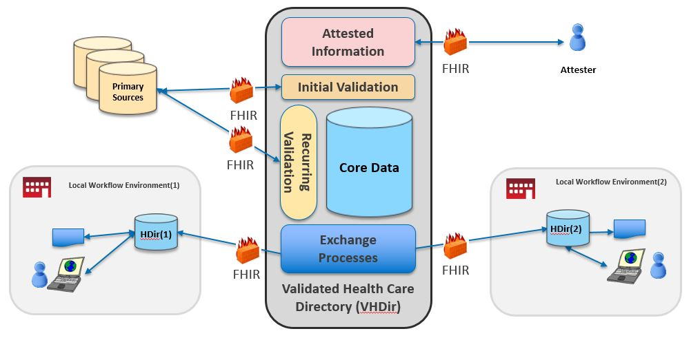



## Introduction

The Validated Healthcare Directory (VHDir) Implementation Guide is based on [FHIR Version 4.0](http://build.fhir.org/) and defines the minimum conformance requirements for accessing or exposing validated healthcare directory data. It provides a specification for the exchange of directory data between a source of validated provider data to local workflow environments (e.g. local directories). The specification is intended to support international stakeholders and meet the specific needs of the US Realm.  

This implementation guide was developed in cooperation with the [Office of the National Coordinator for Health Information Technology (ONC)] and [Federal Health Architecture (FHA)](https://www.healthit.gov/policy-researchers-implementers/federal-health-architecture-fha) with  guidance from HL7 International, the Patient Administration workgroup, and the HL7 US Realm Steering Committee.

For more information on the history of Validated Healthcare Directory see the [Validated Healthcare Directory change notes](vhdir-change-notes.html).  

For more information on the ONC and FHA effort see the [ONC Techlab Healthcare Directory Project](https://oncprojectracking.healthit.gov/wiki/display/TechLabSC/Healthcare+Directory).

## Validated Healthcare Directory Actors

The following actors are part of the VHDir IG:

* Validated Healthcare Directory Requestor: An application that initiates a data access request to retrieve directory data. This can be thought of as the client in a client-server interaction.
* Validated Healthcare Directory Responder: A product that responds to the data access request providing directory data. This can be thought of as the server in a client-server interaction.

## Validated Healthcare Directory Local Use Cases

To determine the data elements necessary for the exchange of directory information, the authors developed a number of local use cases currently supported by healthcare directories. The local se cases describe the general information requirements (e.g. demographic information, endpoints, relationships between orgs/providers) needed to support the local use case. From these, we devised a set of discrete data elements. This implementation guide covers all of the data elements that make sense to collect at a national level, validate, and exchange with local workflow environments. The local use cases, used to discover general information requirements, included:  

### A - Basic Information Exchange

    A1 - Enable electronic exchange (e.g. discovery of electronic end points such as IHE/EHR endpoints, FHIR server URLs, Direct addresses)

    A2 - Find an individual and/or organization (even if no electronic end point is available)

### B -Patient/Payer focused

    B1 - Find provider accessibility information (specialty, office hours, languages spoken, taking patients)

    B2 - Relationship between provider and insurance plan (insurance accepted) or plan and provider (network)

    B3 - Plan selection and enrollment

    B4 - Claims management (adjudication, prior authorization, payment)

### C - Care Delivery/Value-Based Care

    C1 - Provider relationship with a patient (e.g. for alerts)

    C2 - Provider relationship with other providers in context of a patient (e.g. care team communications)

### D - Other

    D1 - Provider credentialing

    D2 - Quality or regulatory reporting (e.g. aggregate data, plan networks)

    D3 - Detection of fraud; inappropriate approval of services and/or payment for services'

## Validated Healthcare Directory Concept Diagram

<figure class="figure">
<figcaption class="figure-caption"><strong>Figure 1: Validated Healthcare Directory Concept Diagram</strong></figcaption>
  
</figure>

**Attestation and validation**

We designed the VHDir implementation guide to support the sharing of information from a directory of healthcare information that was both attested and validated against primary sources. Attested data is supplied by an individual (see attester) on their own behalf or who are authorized to supply data on behalf of another individual or organization. Attester asserts data they are supplying is true. 

The implementer (not shown on the diagram) of a VHDir may validate resources or elements against primary sources, validating the truthfulness and accuracy of the attested data. For example, implementer may validate graduation from medical school with the medical school; medical licenses with the state licensure board, board certification with the board certifying, etc. In practice, third parties also provide services to validate such information, in some cases such validation is considered equivalent to validation against primary sources. Implementer may validate other operational data such as validating addresses against post office address validation routines.

Validation involving “relationships” may requiring verification against two primary sources. For example, a provider offering services through a particular insurance network may be validated against with the provider themselves and with the insurance network. 

The concept diagram indicates initial validation and recurring validation. Initial validation occurs when data are newly attested. For data that are subject to change over time, e.g. the status of a license, recurring validation may occur. It would be likely any implementation also have capacity to handle frequent or real time updates.

Implementer may consider attestation alone sufficient for some resources. Examples include languages spoken, proficiency of speaking foreign language, descriptions of accessibility such as handicapped ramps, self-declared cultural competencies, etc. 

**VHDir and Local Environment**

We designed VHDir IG to support large-scale implementations, for example a directory maintained at a national level. Such scale provides advantages such as the ability for individuals and organizations to attest once; to provide a single point for validation with the ability to record and share validation details.  “Local workflow environments” include, but are not limited to, Commercial Payers, Provider Organizations, Health Information Exchanges (HIEs), Health Information Service Providers (HISPS) and agencies such as Centers for Medicare and Medicaid Services (CMS), Social Security Administration, Department of Defense and Veterans Administration.

“Core data” may include data that is not of interest to all local environments, but use case specific. It is likely some local environments may not request all the data. The VHDir offers the ability to share specific data through the exchange process based on what is queried and, in some cases, data use agreements should data in the VHDir not considered “public”. Local workflow environments will likely have data “local only data” that is used in addition to data they obtain from the VHDir. These data are likely operational or specific to the local environment and thus would not be shared in the.

This diagram represents all data exchange via FHIR. Any implementer may operationalize some part of primary source validation or attestation through other means. 

## Validated Healthcare Directory Profiles

The list of Validated Healthcare Directory Profiles is shown below.  Each profile defines the minimum mandatory elements, extensions and terminology requirements that **MUST** be present. For each profile, requirements and guidance are given in a simple narrative summary. A formal hierarchical table that presents a [logical view] of the content in both a differential and snapshot view is also provided along with references to appropriate terminologies and examples.  In addition each profile has a "Quick Start" section which is intended as an implementer friendly overview of the required search and read operations.



## Validated Healthcare Directory Conformance Requirements

The [Capability Statements Section](capstmnts.html) outlines conformance requirements for Validated Healthcare Directory Servers and Client applications, identifying the specific profiles, RESTful operations and search parameters that need to be supported.

Note: The individual Validated Healthcare Directory profiles identify the structural constraints, terminology bindings and invariants, however, implementers must refer to the conformance requirements for details on the RESTful operations, specific profiles and the search parameters applicable to each of the Validated Healthcare Directory actors.

----

Primary Authors: Brian Postlethwaite, Bob Dieterle, Daniel Chaput, Alex Kontur

Secondary Authors: Grahame Grieve, Lloyd McKenzie

[Argonaut]: http://argonautwiki.hl7.org/index.php?title=Main_Page
[Validated Healthcare Directory Security]: US Core-security.html
[Office of the National Coordinator for Health Information Technology (ONC)]: http://www.healthit.gov/newsroom/about-onc
[Data Access Framework]: http://wiki.siframework.org/Data+Access+Framework+Homepage
[profiles]: http://hl7.org/fhir/STU3/profiling.html
[logical view]: http://hl7.org/fhir/STU3/formats.html#table
[StructureDefinitions]: http://hl7.org/fhir/STU3/structuredefinition.html
[Value sets]: http://hl7.org/fhir/STU3/valueset.html
[CodeSystem]: http://hl7.org/fhir/STU3/codesystem.html
[ConceptMap]: http://hl7.org/fhir/STU3/conceptmap.html
[NamingSystem]: http://hl7.org/fhir/STU3/namingsystem.html
[FHIR Conformance Rules]: http://hl7.org/fhir/STU3/CapabilityStatement-rules.html
[dataAbsentReason]: http://hl7.org/fhir/STU3/extension-data-absent-reason.html
[FHIR Terminology]: http://hl7.org/fhir/STU3/terminologies.html
[FHIR RESTful API]: http://hl7.org/fhir/STU3/http.html
[HTTP]: http://hl7.org/fhir/STU3/http.html
[FHIR Data Types]: http://hl7.org/fhir/STU3/datatypes.html
[FHIR Search]: http://hl7.org/fhir/STU3/search.html
[FHIR Resource]: http://hl7.org/fhir/STU3/formats.html
[2015 Edition Common Clinical Data Set]: guidance.html#edition-common-clinical-data-set
